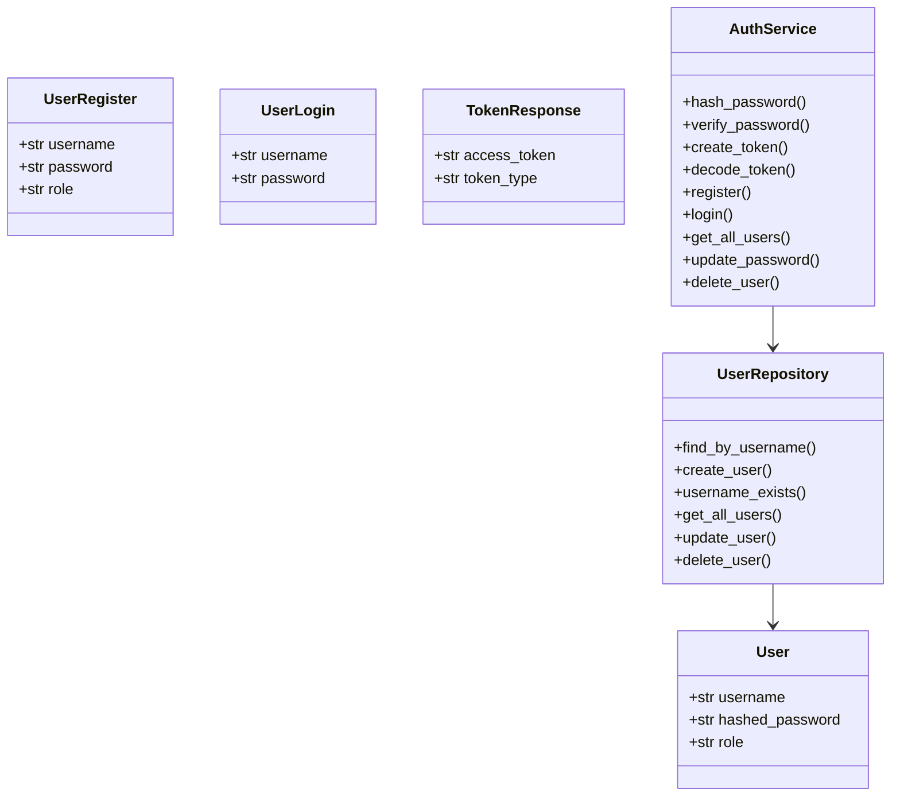
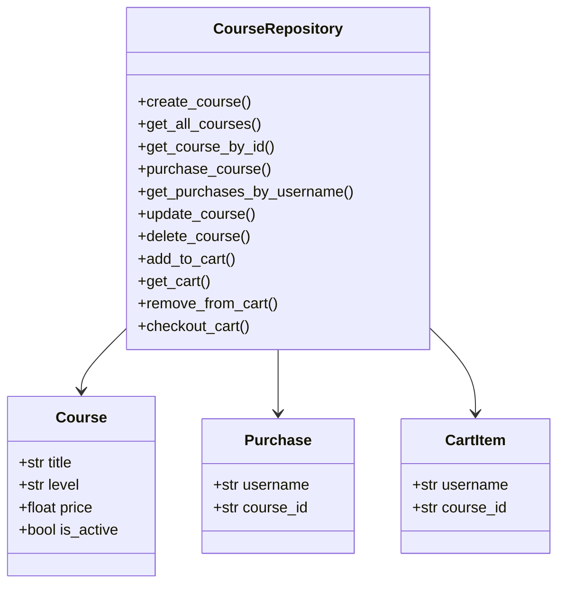
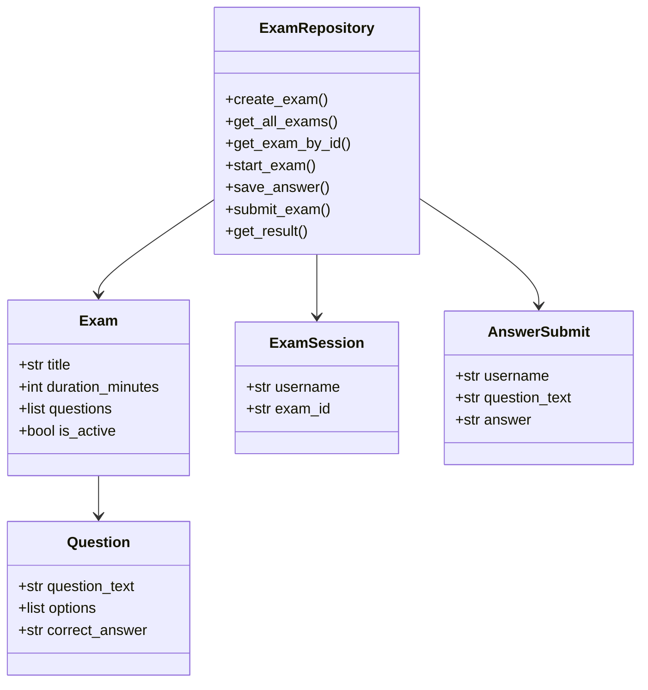
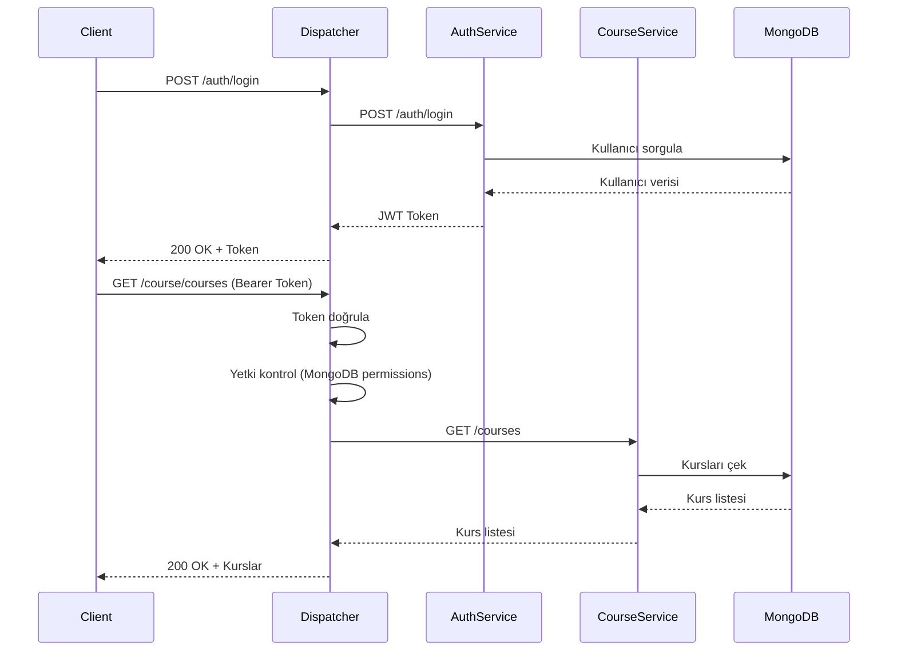
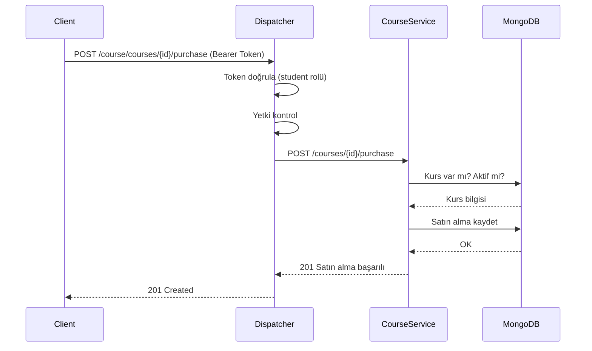
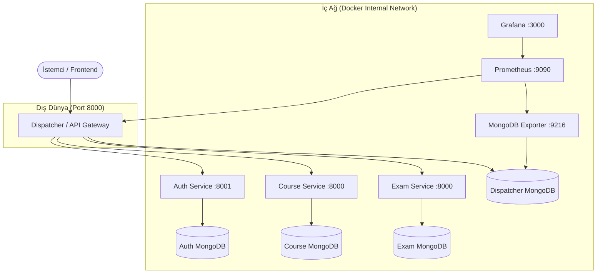
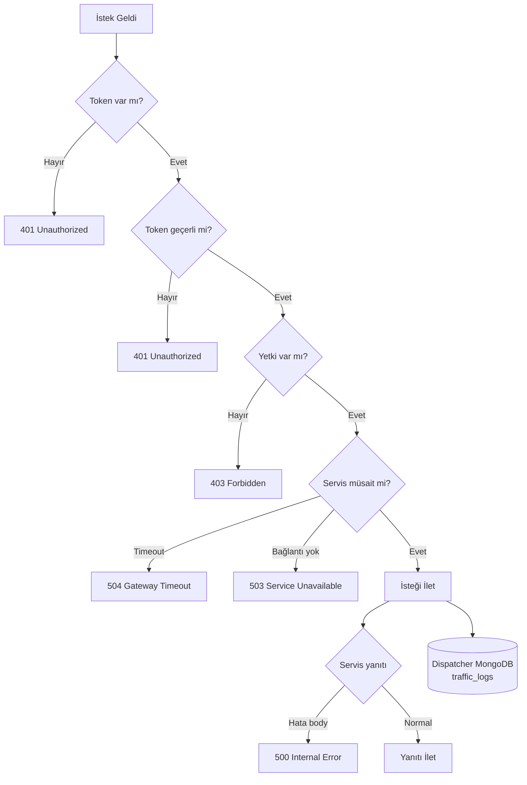
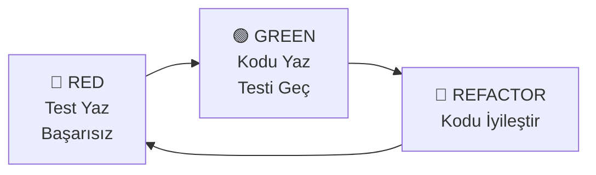
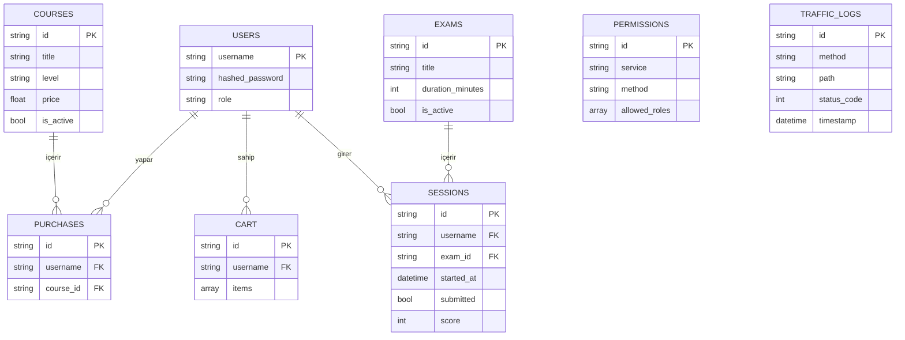

# Academy Microservices Architecture

**Ekip Üyeleri:**
- Emir Tekin (231307062)
- Ediz Sevinçler (231307020)

**Tarih:** 05/04/2026

---

## 1. Giriş

### Problemin Tanımı
Günümüzde eğitim kurumlarında öğrenciler ders dışında kendilerini geliştirmek için yeterli dijital kaynaklara erişememektedir. Geleneksel monolitik sistemler, vize/final haftaları gibi yoğun dönemlerde yüksek trafik altında çökmekte ve öğrencilere kesintisiz hizmet sunamamaktadır.

### Amacımız
Bu projede öğrencilerin kurs satın alabileceği, sınav çözebileceği ve dil becerilerini geliştirebileceği ölçeklenebilir bir platform geliştirilmiştir. Sistem; mikroservis mimarisi, merkezi bir API Gateway (Dispatcher) ve bağımsız veritabanlarıyla yüksek trafik altında dahi kesintisiz çalışacak şekilde tasarlanmıştır.

---

## 2. Tasarım ve Teorik Altyapı

### 2.1 Literatür İncelemesi
Udemy, Coursera gibi modern eğitim platformları incelenmiştir. Bu platformların monolitik yapısının yarattığı ölçeklenebilirlik sorunları göz önünde bulundurularak mikroservis mimarisi benimsenmiştir. Martin Fowler'ın mikroservis tanımına göre, her servis bağımsız olarak deploy edilebilir, kendi veritabanına sahiptir ve servisler arası iletişim hafif protokollerle (HTTP/JSON) sağlanır.

### 2.2 RESTful Servisler ve Richardson Olgunluk Modeli

**RESTful Prensipler:**
- Kaynak odaklı URL tasarımı (/courses, /exams, /auth)
- Standart HTTP metodları (GET, POST, PUT, DELETE)
- Durumsuzluk (Statelessness) — her istek kendi token'ını taşır
- JSON formatında veri transferi
- İstemci-sunucu bağımsızlığı

**Richardson Olgunluk Modeli — Seviye 2:**

Projemiz RMM Seviye 2 standartlarını karşılamaktadır:

| Seviye | Açıklama | Projemizdeki Karşılığı |
|--------|----------|------------------------|
| Level 0 | Tek endpoint | ❌ Kullanılmadı |
| Level 1 | Kaynak bazlı URL | ✅ /courses, /exams, /auth |
| Level 2 | HTTP metodları | ✅ GET/POST/PUT/DELETE |
| Level 3 | HATEOAS | - |

### 2.3 Sınıf Yapıları

**Auth Service Sınıf Diyagramı:**



**Course Service Sınıf Diyagramı:**



**Exam Service Sınıf Diyagramı:**



### 2.4 Sequence Diyagramları

**Login ve Kurs Listeleme Akışı:**



**Kurs Satın Alma Akışı:**



**Karmaşıklık Analizi:**

| İşlem | Zaman Karmaşıklığı | Açıklama |
|-------|-------------------|----------|
| Token doğrulama | O(1) | JWT decode sabit süre |
| Yetki kontrolü | O(n) | n = permission kuralı sayısı |
| Kurs listeleme | O(n) | n = kurs sayısı |
| Kullanıcı arama | O(log n) | MongoDB index ile |

---

## 3. Sistem Mimarisi

### 3.1 Genel Mimari



### 3.2 Network İzolasyonu

Mikroservisler dış dünyaya kapalıdır. Yalnızca Dispatcher `ports` ile dışarıya açılmış, diğer servisler `expose` ile sadece iç ağa açılmıştır.

```yaml
dispatcher:
  ports:
    - "8000:8000"   # Dışarıya açık

auth-service:
  expose:
    - "8001"        # Sadece iç ağa açık

course-service:
  expose:
    - "8000"        # Sadece iç ağa açık
```

**Network İzolasyonu Kanıtı:**

Aşağıdaki ekran görüntüleri, mikroservislere dışarıdan doğrudan erişimin engellendiğini kanıtlamaktadır:

❌ **Direkt erişim denemesi — BAŞARISIZ (port dışarıya kapalı):**


✅ **Dispatcher üzerinden erişim — BAŞARILI:**


### 3.3 Dispatcher Akış Diyagramı



### 3.4 TDD Yaklaşımı

Dispatcher servisi TDD (Red-Green-Refactor) metodolojisiyle geliştirilmiştir. Test dosyalarının commit zaman damgası, fonksiyonel kodlardan öncedir.



**Test Kapsamı (Dispatcher):**

| Test No | Senaryo | Beklenen |
|---------|---------|----------|
| 1 | Başarılı yönlendirme | 200 OK |
| 2 | Token yok | 401 |
| 3 | Token bozuk | 401 |
| 4 | Yetkisiz rol | 403 |
| 5 | Servis hatası | 500 |
| 6 | Servis ölü | 503 |
| 7 | Timeout | 504 |
| 8-19 | Diğer senaryolar | Çeşitli |

### 3.5 Veritabanı E-R Diyagramı



---

## 4. API Endpoint Tabloları

### Auth Service

| Method | Endpoint | Açıklama | Rol |
|--------|----------|----------|-----|
| POST | /auth/register | Kayıt ol | Herkese açık |
| POST | /auth/login | Giriş yap | Herkese açık |
| GET | /auth/verify | Token doğrula | Herkese açık |
| GET | /auth/users | Kullanıcı listele | Admin |
| GET | /auth/user/{username} | Kullanıcı getir | Admin |
| PUT | /auth/user/{username} | Şifre güncelle | Admin/Kendisi |
| DELETE | /auth/user/{username} | Kullanıcı sil | Admin |

### Course Service

| Method | Endpoint | Açıklama | Rol |
|--------|----------|----------|-----|
| GET | /course/courses | Kurs listele | Herkes |
| GET | /course/courses/{id} | Kurs getir | Herkes |
| POST | /course/courses | Kurs oluştur | Teacher/Admin |
| PUT | /course/courses/{id} | Kurs güncelle | Teacher/Admin |
| DELETE | /course/courses/{id} | Kurs sil | Teacher/Admin |
| POST | /course/courses/{id}/purchase | Kurs satın al | Student |
| GET | /course/courses/my-purchases | Satın alınanlar | Student |
| POST | /course/courses/cart/add | Sepete ekle | Student |
| GET | /course/courses/cart | Sepet görüntüle | Student |
| DELETE | /course/courses/cart/{id} | Sepetten çıkar | Student |
| POST | /course/courses/cart/checkout | Sepeti satın al | Student |

### Exam Service

| Method | Endpoint | Açıklama | Rol |
|--------|----------|----------|-----|
| GET | /exam/exams | Sınav listele | Herkes |
| GET | /exam/exams/{id} | Sınav getir | Herkes |
| POST | /exam/exams | Sınav oluştur | Teacher/Admin |
| POST | /exam/exams/{id}/start | Sınava gir | Student |
| POST | /exam/exams/{id}/answer | Cevap kaydet | Student |
| POST | /exam/exams/{id}/submit | Sınavı bitir | Student |
| GET | /exam/exams/{id}/result/{username} | Sonuç gör | Herkes |

---

## 5. Kurulum ve Çalıştırma

```bash
# Repoyu klonla
git clone https://github.com/BiraliNesbuik/Academy-Microservices-Architectures.git

# Proje dizinine gir
cd Academy-Microservices-Architectures

# Tüm sistemi ayağa kaldır
docker-compose up --build
```

**Erişim Noktaları:**

| Servis | URL |
|--------|-----|
| API Gateway | http://localhost:8000 |
| Grafana | http://localhost:3000 |
| Prometheus | http://localhost:9090 |
| Frontend | http://localhost:5173 |

---

## 6. Test Sonuçları

### 6.1 Birim Testleri (Pytest)

Dispatcher servisi 19 test ile TDD yaklaşımıyla geliştirilmiştir.

```
tests/test_dispatcher.py - 19 passed
tests/test_course.py     - 14 passed
tests/test_auth.py       - 8 passed
```

### 6.2 Yük Testi Sonuçları (Locust)

| Kullanıcı Sayısı | Medyan Yanıt (ms) | 95. Persentil (ms) | Hata Oranı | RPS |
|-----------------|-------------------|-------------------|------------|-----|
| 50 | 800 | 3200 | %1 | 18.2 |
| 100 | 3100 | 9300 | %3 | 22.1 |
| 200 | 8100 | 30000 | %11 | 20.0 |

#### 50 Kullanıcı Testi

Chart 


Statistics(


#### 100 Kullanıcı Testi

Charts 


Statistics 


#### 200 Kullanıcı Testi

Charts 


Statistics 


### 6.3 Grafana Monitoring

Dispatcher trafiği Prometheus + Grafana ile izlenmektedir. `prometheus-fastapi-instrumentator` kütüphanesi kullanılarak `/metrics` endpoint'i otomatik olarak oluşturulmuştur.

**İzlenen Metrikler:**
- `http_requests_total` — endpoint bazlı toplam istek sayısı
- `http_request_duration_seconds` — yanıt süreleri
- `mongodb_up` — MongoDB sağlık durumu

**Yanıt Süresi Grafiği:**

Yanit Suresi Grafigi 


**Yük Testi ve Trafik Hacmi:**

Yuk Testi ve Trafik Hacmi 


**Trafik Log Tabloları:**

Trafik Log Tablosu 1 


Trafik Log Tablosu 2 


---

## 7. Sonuç ve Tartışma

### Başarılar
- Mikroservis mimarisi başarıyla implemente edilmiştir
- Dispatcher TDD ile geliştirilmiş, 19 test geçmektedir
- Network isolation Docker iç ağı ile sağlanmıştır
- Grafana + Prometheus ile gerçek zamanlı monitoring kurulmuştur
- Role-based access control (RBAC) uygulanmıştır
- Sepet özelliği ile çoklu kurs satın alma desteklenmektedir
- React frontend ile kullanıcı dostu arayüz geliştirilmiştir

### Sınırlılıklar
- Sınav modülünde süre kontrolü frontend tarafında yapılamamıştır
- Servisler arası doğrudan iletişim yoktur, tüm trafik dispatcher üzerinden geçer
- Ödeme sistemi entegre edilmemiştir
- Token yenileme (refresh token) mekanizması bulunmamaktadır

### Olası Geliştirmeler
- Gerçek ödeme gateway entegrasyonu (Stripe, iyzico)
- Sınav süresi otomatik sayacı ve otomatik submit
- Bildirim servisi (email/SMS)
- Cache katmanı (Redis) ile performans artışı
- CI/CD pipeline kurulumu
- Kubernetes ile container orchestration
